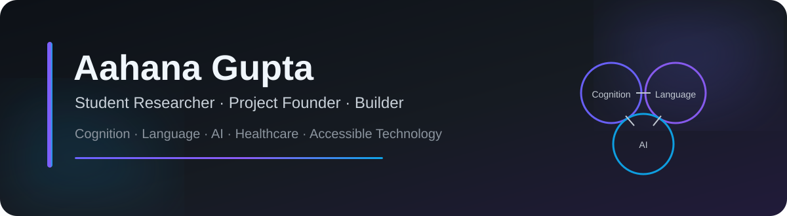
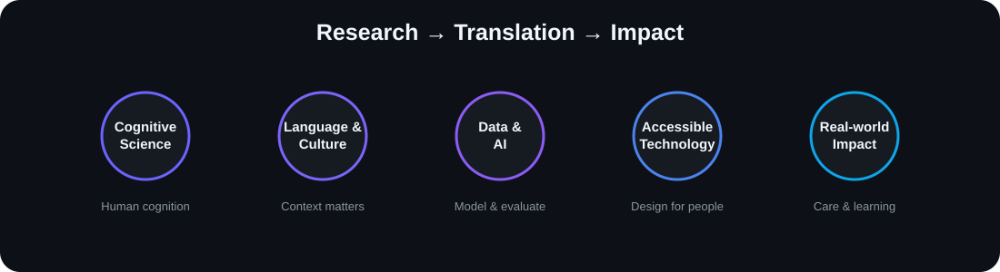

<div align="center">



<br>

[](https://github.com/aahana-gupta-ai)
[](https://github.com/aahana-gupta-ai?tab=followers)
[](#research)
[](#how-i-build)
[](#research)

**Student researcher and project founder exploring cognition, language, AI, and accessible technology.**

I build tools that connect research with practical support for **memory, care, and learning**.  
My central question is how technology can better account for the **languages, cultures, and everyday experiences** of the people who use it.

</div>

---

## About Me

I am an **A-level student at Cardiff Sixth Form College, Class of 2027**, studying **Biology, Mathematics, Psychology, and Chemistry**.

My academic interests lie in **Cognitive Science and Symbolic Systems**, particularly the relationship between **language, human cognition, data, and artificial intelligence**.

My work spans dementia assessment, multilingual technology, AI-assisted care, literacy, computational music, and research translation. Across these areas, I am interested in a common problem: **how to design systems that understand people more carefully instead of treating context as noise**.

<div align="center">
  
</div>

---

## Research

### Cultural Bias in Dementia Assessment

**Lead Researcher & App Developer**

I investigate how language and cultural context influence performance on the **Alzheimer's Disease Assessment Scale–Cognitive Subscale (ADAS-Cog)**.

- Conducted a **120-patient follow-up investigation** with **Prof. Vijay Kumar Chattu**
- Developed a **multilingual ADAS-Cog application supporting four Indian languages**
- Used the application to support study data collection
- Manuscript currently **under review at the _Journal of Clinical Neuroscience_**

### ADAS-Cog Performance in Urban Indian Alzheimer's Patients

**Lead Researcher**

Research with **Dr. Praveen Gupta** examining ADAS-Cog performance among urban Indian Alzheimer's patients.

- First peer-reviewed research paper
- Published in **_Bioinformation_**
- Focused my broader research direction on linguistic and cultural assumptions in cognitive assessment

### Psychiatry & Mental Health

**Researcher & Intern — Fortis Memorial Research Institute, Gurugram**

Under **Dr. Samir Parikh**, I analysed Alzheimer's clinical datasets and examined where DSM-5-based frameworks may diverge from culturally shaped symptoms and experiences.

### Computational Music Research

**Student Researcher — Wolfram Summer Research Program, Bentley University**

I developed a computational essay on **ancient Greek musical systems**, using mathematics, frequency relationships, and computational modelling.

- **Wolfram Summer Research Program — Staff Pick**
- Invited to serve as a **Teaching Assistant**
- Invited to the **Wolfram Emerging Leaders Program**

---

## Project Portfolio

<table>
<tr>
<td width="50%" valign="top">

### Multilingual ADAS-Cog App

A multilingual cognitive-assessment project exploring **culturally adapted ADAS-Cog workflows** and accessible dementia assessment.

**Focus:** `dementia` `multilingual` `healthcare` `research`

<a href="https://github.com/aahana-gupta-ai/multilingual-adas-cog-app"><b>View repository →</b></a>

</td>
<td width="50%" valign="top">

### SmritiCare

Dementia support through **familiar family voices, voice-cloning technology, and WhatsApp-based interaction**.

**Focus:** `artificial-intelligence` `voice-cloning` `dementia` `whatsapp`

<a href="https://github.com/aahana-gupta-ai/smriticare"><b>View repository →</b></a>

</td>
</tr>

<tr>
<td width="50%" valign="top">

### Sahitya

A **WhatsApp-native phonics curriculum** with dyslexia-screening support, connecting literacy education, technology, and community partnerships.

**Focus:** `education` `literacy` `dyslexia` `accessibility`

<a href="https://github.com/aahana-gupta-ai/sahitya-phonics"><b>View repository →</b></a>

</td>
<td width="50%" valign="top">

### Ancient Greek Musical Systems

Computational modelling of ancient Greek tuning systems and frequency ratios using **Wolfram Language**.

**Focus:** `wolfram-language` `computational-music` `music-theory` `mathematics`

<a href="https://github.com/aahana-gupta-ai/greek-music-wolfram"><b>View repository →</b></a>

</td>
</tr>

<tr>
<td colspan="2" valign="top">

### Cultural Bias in Dementia Assessment

A research-focused repository for documentation and reproducible analysis examples using **synthetic or appropriately approved data**.

**Focus:** `data-science` `healthcare` `dementia` `cognitive-science` `research`

<a href="https://github.com/aahana-gupta-ai/dementia-assessment-research"><b>View repository →</b></a>

</td>
</tr>
</table>

### Repository Cards

<div align="center">

<a href="https://github.com/aahana-gupta-ai/multilingual-adas-cog-app">
  
</a>
<a href="https://github.com/aahana-gupta-ai/smriticare">
  
</a>

<a href="https://github.com/aahana-gupta-ai/sahitya-phonics">
  
</a>
<a href="https://github.com/aahana-gupta-ai/greek-music-wolfram">
  
</a>

<a href="https://github.com/aahana-gupta-ai/dementia-assessment-research">
  
</a>

</div>

---

## Impact at a Glance

<div align="center">

|                         400                          |              11,500+               |              104               |                          120                           |                              4                              |
| :--------------------------------------------------: | :--------------------------------: | :----------------------------: | :----------------------------------------------------: | :---------------------------------------------------------: |
| Families supported through early **SmritiCare** work | People reached through **Sahitya** | Anganwadis involved in Sahitya | Participants in follow-up dementia-assessment research | Indian languages supported in the multilingual ADAS-Cog app |

</div>

Additional community work has raised **₹4.91 lakh for children's education**.

---

## GitHub Analytics

<div align="center">


<br>


<br>


</div>

### Contribution Activity

<div align="center">


</div>

### Profile Summary

<div align="center">


</div>

### GitHub Trophies

<div align="center">


</div>

### Contribution Snake

<div align="center">

<picture>
  <source media="(prefers-color-scheme: dark)" srcset="https://raw.githubusercontent.com/aahana-gupta-ai/aahana-gupta-ai/output/github-contribution-grid-snake-dark.svg">
  <source media="(prefers-color-scheme: light)" srcset="https://raw.githubusercontent.com/aahana-gupta-ai/aahana-gupta-ai/output/github-contribution-grid-snake.svg">
  
</picture>

</div>

> The contribution snake is generated by the included GitHub Actions workflow. After uploading this package, run **Actions → Generate contribution snake → Run workflow** once.

---

## How I Build

I begin with a **research question or practical need**, design the workflow, and evaluate it with the people it is intended to support.

```text
Research Question
      ↓
Context & Literature
      ↓
Human Need
      ↓
System Design
      ↓
Prototype
      ↓
Testing & Feedback
      ↓
Iteration
      ↓
Research Translation
```

I write **Wolfram Language** code directly and use AI-assisted development tools for application projects.

**Tools used across my projects:**  
`Wolfram Language` · `Claude Code` · `Manus` · `ElevenLabs` · `WhatsApp`

My project documentation distinguishes my own **research, design, and implementation work** from assistance provided by AI tools and collaborators.

---

## Research & Technology Stack

<div align="center">


</div>

---

## Writing, Leadership & Community

<table>
<tr>
<td width="50%" valign="top">

### Writing

**_The Wrong Words_**  
Co-authored with **Dr. Deepak Rathod**  
ISBN `978-81-994235-0-3`

Explores how Western diagnostic tools can misclassify non-Western patients and how cultural context matters in assessment.

The project raised **$3,500** for physician training in culturally adapted dementia assessment.

</td>
<td width="50%" valign="top">

### Leadership

- **President**, Psychology Club
- Founder of Cardiff's first **International Youth Neuroscience Association chapter**
- Created the **Invisible Assumptions** AI-bias exhibition
- Led or contributed to **10 awareness campaigns**
- Founder & Host — **Notes for the Future**
- Founder — **Fuel a Dream**

</td>
</tr>
</table>

---

## Selected Honours

<div align="center">

| Recognition                          | Result                            |
| ------------------------------------ | --------------------------------- |
| Cambridge Re:think Essay Competition | **Silver — top 0.25% of 15,000+** |
| Technovation Girls                   | **Global Semifinalist**           |
| UKMT Senior Mathematical Challenge   | **Gold**                          |
| Mathematical Olympiad for Girls      | **Distinction**                   |
| Haryana Health Minister Award        | **Youngest recipient**            |
| Wolfram Summer Research Program      | **Staff Pick**                    |

</div>

---

## Music & Creative Work

Music is another part of how I think about **patterns, structure, and human expression**.

- **Trinity College London — Grade 6 Rock & Pop Vocals**
- **Trinity College London — Grade 5 Piano**
- House Vocalist, **Morgan House (Eisteddfod)**

My interest in music also connects directly to my computational work on **ancient Greek musical systems**, where mathematics, sound, history, and computation meet.

---

## Current Interests

<div align="center">

`Cognitive Science` · `Human-Centred AI` · `Multilingual AI` · `Culturally Adaptive Healthcare`  
`Dementia Assessment` · `Digital Health` · `Language & Cognition` · `Computational Modelling`  
`Responsible AI` · `Accessible Education`

</div>

---

## Looking Ahead

My long-term interest is in studying and building at the intersection of **Cognitive Science, Symbolic Systems, Artificial Intelligence, and Human-Centred Technology**.

I want to develop systems that:

- understand people more carefully,
- work across languages and cultures,
- reduce avoidable bias,
- support healthcare and education, and
- translate research into practical tools beyond the laboratory.

---

<div align="center">

### Research that understands people. Technology that respects context.

<br>

**Aahana Gupta**  
Student Researcher · Founder · Builder

<br><br>

<a href="https://github.com/aahana-gupta-ai">
  
</a>

<br><br>


</div>
